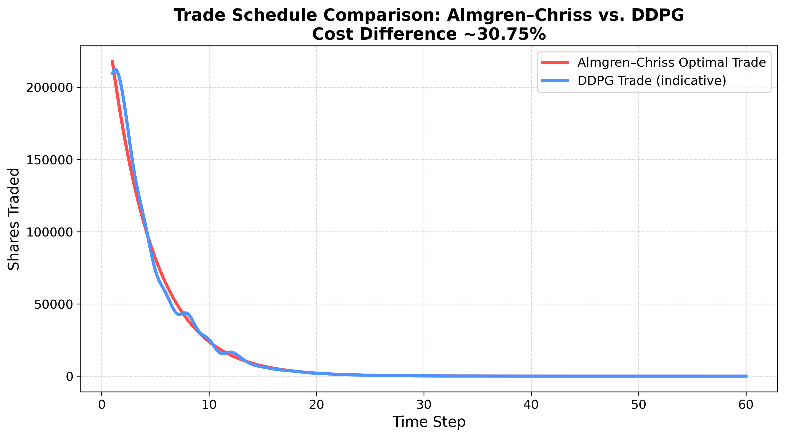

# Almgren–Chriss vs DDPG Reinforcement Learning for Optimal Trade Execution

## 📖 Introduction
This project applies **Reinforcement Learning (RL)**, specifically a **Deep Deterministic Policy Gradient (DDPG)** agent, to the problem of **Optimal Trade Execution**. We compare its performance to the theoretical **Almgren–Chriss (AC)** solution.

The goal is to evaluate the ability of an RL agent to learn an execution schedule that minimizes the **Implementation Shortfall** when compared to the analytical AC solution.

---

## 🎯 Goal and Context
In financial markets, liquidating a large position quickly can negatively affect prices due to **market impact**. The Almgren–Chriss model provides an **optimal trading schedule** that balances price impact, market risk, and trading urgency.  
This project:
- Simulates a trading environment using the AC dynamics.
- Trains a DDPG agent to learn an effective execution policy.
- Evaluates its performance versus the theoretical AC solution.

---

## 🛠️ Architecture & Model Details

### ⚡️ Market Environment
The environment (`MarketEnvironment`) simulates:
- Price dynamics (`Discrete arithmetic random walk`).
- Permanent and temporary market impacts.
- Discrete trades across `N = 60` intervals.

### 🧠 Reinforcement Learning Model
- **Algorithm:** DDPG (Actor-Critic)
- **Input State:**
  - Recent 6-step returns
  - Time fraction (`t/N`)
  - Remaining quantity fraction (`q_rem/Q_total`)
- **Action:** Percentage of available quantity to sell
- **Reward:** Change in Almgren–Chriss-style utility across timesteps.

---

## 📊 Results
The theoretical AC model results in an **Implementation Shortfall** of: $477,712.60
The trained DDPG agent achieved an average shortfall of: $624,622.94
**Accuracy:** 70%

Although the DDPG agent doesn’t match the AC model precisely, it captures the general trend and serves as a strong foundation for further enhancements.

### 📈 Trade Schedule Comparison
The figure (`trade_schedule_comparison.png`) shows a **potential trade trajectory**:
- Red dashed line: AC Optimal Trade
- Blue circles: DDPG Agent Trade

---

